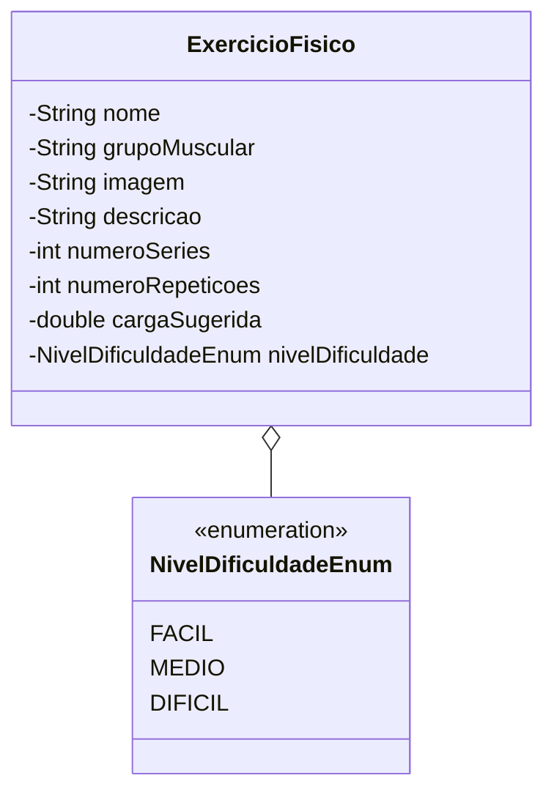

# Avaliação prática: API REST para catálogo de exercícios físicos

Esta atividade avaliativa tem como objetivo construir os componentes iniciais de uma API REST em Java com Spring Boot e banco de dados Microsoft SQL Server. O sistema servirá de backend para a tela de detalhes de exercícios de um aplicativo mobile de treinamento físico.

A entrega será realizada em duplas, utilizando o fluxo de trabalho colaborativo com Git e GitHub (fork, branch, commits e Pull Request).

---

## Contexto do projeto

A equipe de desenvolvimento mobile finalizou o protótipo da tela de detalhes de exercícios. Para que o aplicativo funcione, precisamos disponibilizar os dados por meio de uma API REST.

Abaixo está o diagrama conceitual das classes que devem ser mapeadas:



Na interface do aplicativo móvel, a tela "Detalhes do Exercício" exibe as seguintes informações:

- Nome do exercício (exemplo: "Supino")
- Grupo muscular trabalhado (exemplo: "Peitoral")
- Imagem ilustrativa da execução do movimento
- Descrição da técnica e benefícios do exercício
- Número de séries recomendadas (exemplo: 3)
- Número de repetições por série (exemplo: 15)
- Carga sugerida em kg (exemplo: 70.0)
- Nível de dificuldade representado em escala de 1 a 3 estrelas, correspondente a `FÁCIL`, `MÉDIO` ou `DIFÍCIL` (no caso do Supino, 3 estrelas equivalem a `DIFICIL`)

---

## Orientações gerais

1. A atividade deve ser feita em duplas.
2. Cada dupla deve realizar no mínimo **dois commits** durante o desenvolvimento da atividade.
3. O controller deve injetar e acionar o repositório diretamente.
4. Implemente apenas endpoints de leitura (`@GetMapping`).
5. Organize o código do projeto nos pacotes `entity`, `repository` e `controller`.

---

## Enunciado das etapas

### Etapa 1: Fork, branch e identificação da dupla

1. Um dos integrantes da dupla deve acessar o repositório base no GitHub e realizar um **Fork**:
   - URL do repositório: `https://github.com/etechas/pw2-av3`
2. Clone o repositório forjado para a sua máquina de desenvolvimento.
3. Crie uma nova branch com os primeiros nomes dos integrantes da dupla separados por hífen (exemplo: `ana-carlos`):
   ```bash
   git checkout -b nome1-nome2
   ```
4. No arquivo `duplas.md`, adicione os nomes completos e o número de matrícula/RA de cada integrante da dupla.
5. Faça o primeiro commit registrando a identificação da dupla no repositório.

---

### Etapa 2: Inicialização do projeto no Spring Initializr

Acesse o site [Spring Initializr](https://start.spring.io/) e configure o projeto com as seguintes definições:

- **Project**: Maven
- **Language**: Java
- **Spring Boot**: versão estável atual
- **Java**: 25
- **Packaging**: Jar

Selecione obrigatoriamente as seguintes dependências:
- **Spring Web**: para criação de APIs REST e uso do Spring MVC.
- **Spring Data JPA**: para persistência com Hibernate e repositories.
- **MS SQL Server Driver**: driver JDBC para conexão com o banco de dados Microsoft SQL Server.
- **Lombok**: biblioteca para geração automática de getters, setters e construtores via anotações.

Gere o arquivo compactado (`.zip`), descompacte o conteúdo na raiz do repositório clonado e copie todo o conteúdo para a pasta clonada de `pw2-av3`.

---

### Etapa 3: Script de banco de dados (SQL Server)

1. Crie um arquivo chamado `script_banco.sql` na raiz do projeto contendo os comandos SQL para a criação da base de dados e da tabela para o Microsoft SQL Server.

2. **Carga inicial de dados**:
   - Insira o registro do exercício "Supino" com os mesmos dados exibidos na tela do aplicativo.   

---

### Etapa 4: Enum e entidade JPA com Lombok

No pacote `entity`, implemente:

1. **Enum `Nivel Dificuldade Enum`**:
   - Valores: `FACIL`, `MEDIO` e `DIFICIL`.

2. Entidade para **Classe `Exercicio Fisico`**.
   
---

### Etapa 5: Interface repository com Spring Data JPA

No pacote `repository`, crie a interface `Repository`.

---

### Etapa 6: Controller REST (apenas métodos GET)

No pacote `controller`, crie a classe `Controller`:

- Injete a dependência do `Repository`.
- Crie os seguintes endpoints de consulta:

1. **Listar todos os exercícios**:

2. **Buscar exercício por ID**:

3. **Listar os níveis de dificuldade disponíveis**:

---

### Etapa 7: Commits, push e abertura do Pull Request

1. Certifique-se de que a branch de trabalho possui **no mínimo dois commits**. Exemplo de divisão sugerida:
   - **Commit 1**: identificação da dupla no arquivo `duplas.md` e configuração inicial do projeto Spring.
   - **Commit 2**: implementação do script de banco, classes da entidade, repository e controller.
2. Envie a branch local para o seu repositório no GitHub:
   ```bash
   git push origin nome1-nome2
   ```
3. No GitHub, abra um **Pull Request** da branch criada na sua conta apontando para a branch principal (`main`) do repositório original (`etechas/pw2-av3`).
4. No título do Pull Request, coloque: `Avaliação 3 - Nome1 e Nome2`.

---

## Critérios de correção e pontuação

| Item | Descrição | Pontuação |
| :--- | :--- | :---: |
| Fluxo Git e GitHub | Fork, criação da branch com nome da dupla, preenchimento do `duplas.md`, no mínimo 2 commits e abertura do PR | 1,5 |
| Setup do projeto | Configuração no Spring Initializr com dependências corretas (Web, Data JPA, SQL Server Driver, Lombok) | 1,0 |
| Script SQL Server | Tabela com tipos adequados, constraints e inserts funcionais baseados no aplicativo | 2,0 |
| Mapeamento JPA | Entidade com anotações JPA, uso do Lombok e enum persistido como STRING | 1,5 |
| Repository | Interface declarada corretamente estendendo `JpaRepository` com os tipos apropriados | 1,0 |
| Controller e endpoints GET | Injeção via construtor e implementação dos 3 endpoints GET com status 200, 204 e 404 | 3,0 |
| **Total** | | **10,0** |

---

